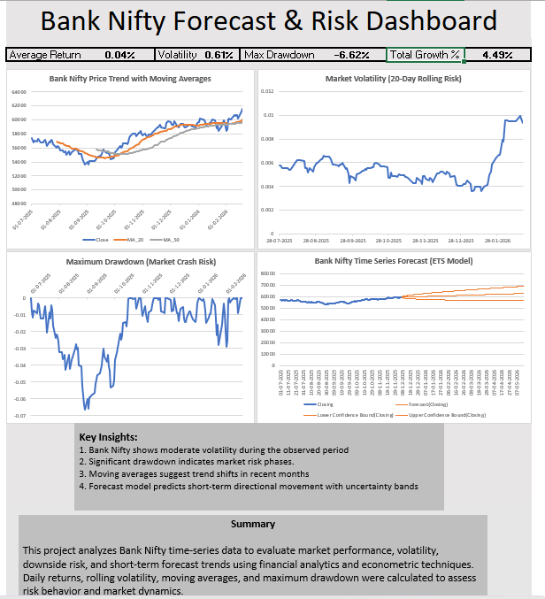

📊 Bank Nifty Forecast & Risk Analytics Dashboard

📌 Project Overview

This project presents an end-to-end financial analytics solution using Bank Nifty time-series data to analyze market trends, volatility, downside risk, and future price forecasting. The dashboard integrates financial metrics, econometric concepts, and time-series forecasting to support data-driven market analysis.

🎯 Objective

To evaluate Bank Nifty performance and forecast short-term trends while analyzing market risk using rolling volatility, moving averages, maximum drawdown, and ETS-based forecasting techniques.

🛠️ Tools & Technologies Used

Microsoft Excel (Advanced)

Time Series Forecasting (ETS Model)

Financial Analytics

Data Visualization

Econometric Concepts

📂 Dataset

Source: Historical Bank Nifty Data

Frequency: Daily Trading Data

Features Used:

Date

Open

High

Low

Close

📈 Key Analysis Performed

Daily Return Calculation

Log Return Analysis (Econometric approach)

20-Day & 50-Day Moving Averages

Rolling Volatility (20-Day Risk Indicator)

Maximum Drawdown (Crash Risk Analysis)

Time Series Forecasting using ETS Model

Continuous Timeline Handling (Non-trading days adjustment)

📊 Dashboard Features

KPI Metrics (Return, Volatility, Drawdown, Growth)

Price Trend with Moving Averages

Volatility Risk Monitoring Chart

Maximum Drawdown Visualization

Forecast vs Actual Trend with Confidence Intervals

🔮 Forecasting Methodology

Since financial markets have non-uniform trading days, a continuous timeline was constructed to handle missing weekends and holidays. ETS (Exponential Smoothing) forecasting was applied to predict short-term Bank Nifty trends with confidence intervals.

📌 Key Insights

Identified volatility spikes indicating high-risk market phases

Moving averages highlighted trend shifts and momentum changes

Drawdown analysis captured major downside risk periods

Forecast model indicated short-term directional trends with uncertainty bands

💼 Project Relevance

This project demonstrates skills in:

Financial Data Analysis

Risk Analytics

Time Series Forecasting

Dashboard Development

Econometric Thinking

Suitable for roles such as:

Data Analyst

Financial Analyst

Research Analyst

👨‍💻 Author

Kushagra Mishra
MA Economics (Econometrics) | Data Analytics | Finance Analytics
